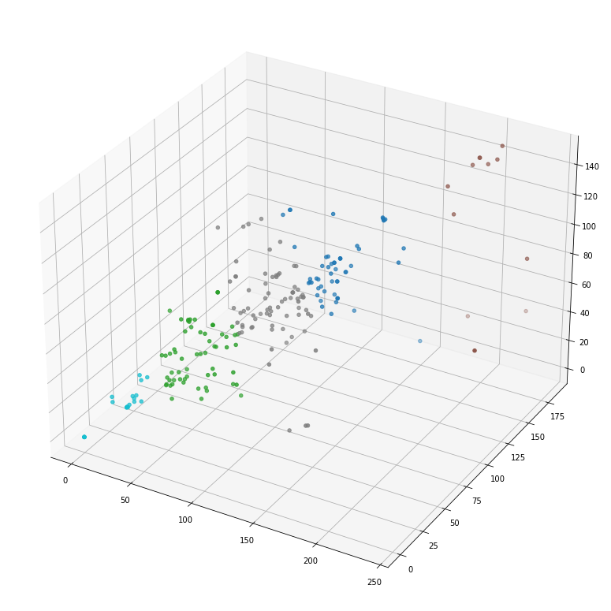
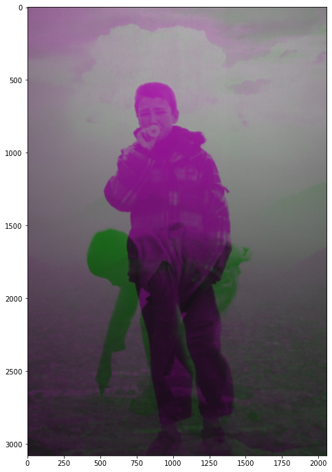

# visual_repurposing
This is a python repository with some code i developed to do what i call "visual repurposing", so an algorithmic equivalent of what pop art exponents used to do: combine pieces of already existing art to create new art. It is meant to extract pieces of pictures and combine them on a background as to create visually stimulating images.

There is also an application of K-means clustering as to group the pieces that we then glue to the background chromatically speaking. We use the average on the RGB channels as three features for clustering input.

Here you can see a plotting of results of a clustering and the corresponding ordered image fragments.

Here an example of RGB channel mixing from different sources (see use_RGB_forge.ipynb):

